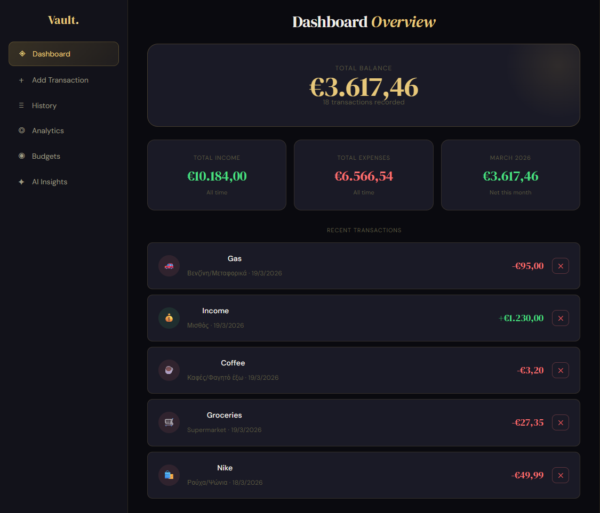

# 💎 Vault - Personal Finance Manager

> A full-stack personal finance application designed to help you manage your money with clarity and ease. Features a modern, dark-themed dashboard with real-time insights.


---

## 📸 Screenshots



---

## ✨ Key Features

- **📊 Interactive Dashboard** — Real-time summary of your Balance, Income, and Expenses.
- **🎯 Budget Management** — Set monthly limits per category and track progress with visual bars.
- **📈 Data Visualization** — Spending patterns shown through responsive Pie and Bar charts (Recharts).
- **📜 Transaction History** — A complete, organized record of all financial movements.
- **🛡️ Secure Setup** — Uses `.env` environment variables to keep database credentials safe.

---

## 🛠️ Tech Stack

| Layer       | Technology                  |
|-------------|-----------------------------|
| Frontend    | React.js, Tailwind CSS, Recharts |
| Backend     | Node.js, Express.js         |
| Database    | MySQL                       |
| Version Control | Git & GitHub            |

---

## ✅ Prerequisites

Make sure you have the following installed before you begin:

- [Node.js](https://nodejs.org/) v18 or higher
- [npm](https://www.npmjs.com/) v9 or higher
- [MySQL](https://www.mysql.com/) v8 or higher
- A MySQL client (e.g. MySQL Workbench, TablePlus, or the CLI)

---

## 🚀 Installation & Local Setup

### 1. Clone the repository

```bash
git clone https://github.com/Stelios-developer/Vault-finance-app.git
cd Vault-finance-app
```

---

### 2. Database Configuration

1. Open your MySQL client.
2. Run the SQL commands found in `database.sql` to create the database and tables:

```bash
mysql -u root -p < database.sql
```

---

### 3. Backend Setup

1. Navigate to the root folder (if you're not already there):

```bash
cd Vault-finance-app
```

2. Create a `.env` file based on the example:

```bash
cp .env.example .env
```

3. Open `.env` and fill in your MySQL credentials:

```env
DB_HOST=localhost
DB_USER=root
DB_PASSWORD=your_password_here
DB_NAME=vault
PORT=5000
```

4. Install dependencies and start the server:

```bash
npm install
node server.js
```

The backend will be running at `http://localhost:5000`.

---

### 4. Frontend Setup

1. Navigate to the frontend folder:

```bash
cd frontend
```

2. Install dependencies and start the dev server:

```bash
npm install
npm run dev
```

The frontend will be running at `http://localhost:5173`.

---

## 📁 Project Structure

```
Vault-finance-app/
├── frontend/          # React.js frontend
│   ├── src/
│   │   ├── components/
│   │   ├── pages/
│   │   └── App.jsx
│   └── package.json
├── database.sql       # SQL schema & seed data
├── server.js          # Express.js entry point
├── .env.example       # Environment variable template
├── package.json
└── README.md
```

---

## 🤝 Contributing

Contributions are welcome! Feel free to open an issue or submit a pull request.

1. Fork the repository
2. Create your feature branch: `git checkout -b feature/my-feature`
3. Commit your changes: `git commit -m 'Add my feature'`
4. Push to the branch: `git push origin feature/my-feature`
5. Open a Pull Request

---

## 📄 License

This project is licensed under the [MIT License](LICENSE).

---

<div align="center">
  Developed with ❤️ by <a href="https://github.com/Stelios-developer">Stelios</a>
</div>
